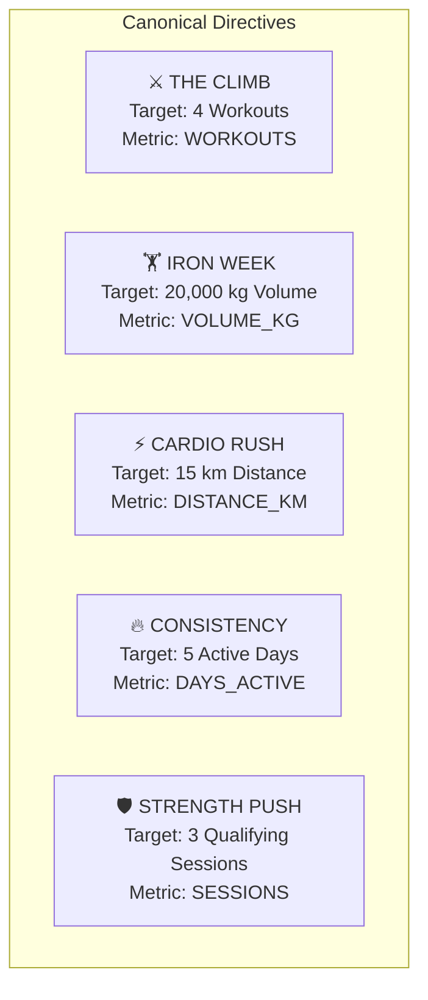
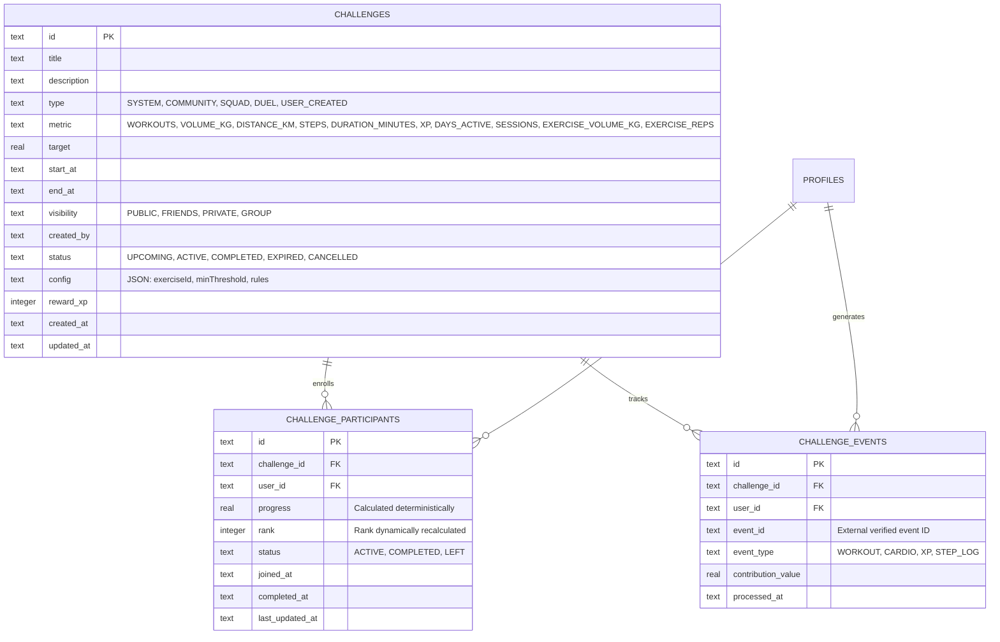
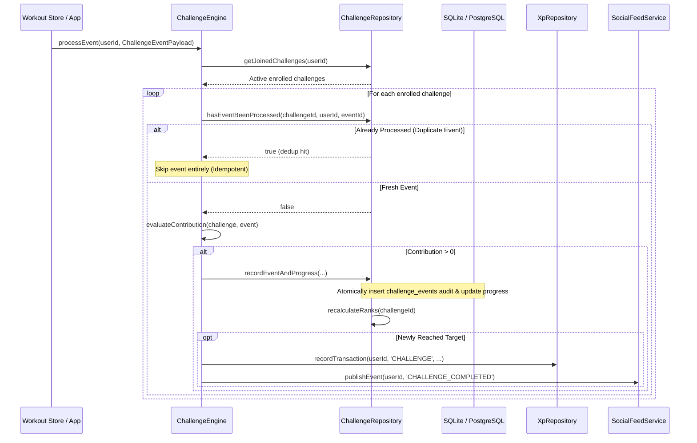
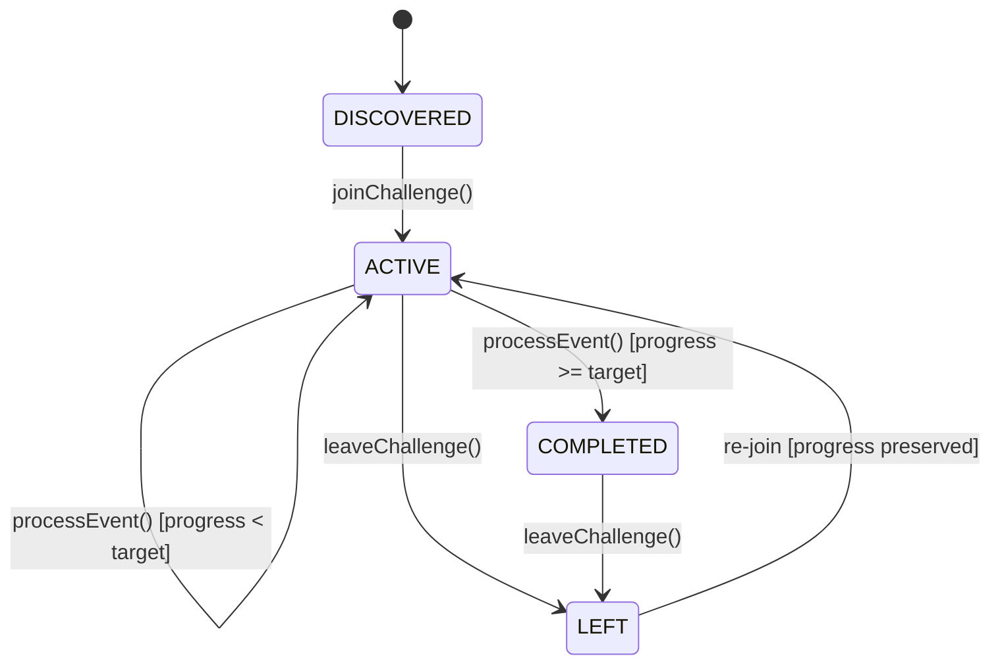

# ASCEND — Reusable Challenge Engine Architecture

## 1. Core Philosophy: Tactical Directives & Squad Competition

The ASCEND Challenge Engine provides a reusable, deterministic framework for individual and squad-based athletic directives. It is designed around the core tenets of ASCEND:
1. **Mathematical Determinism:** Challenge progress is derived purely from verified training events, never from unvalidated client mutations.
2. **Anti-Tamper & Deduplication:** Client applications cannot directly write progress or scores. Every contribution is validated against an immutable audit ledger (`challenge_events`) with strict idempotency keys.
3. **Privacy-Safe Competition:** Leaderboards foster collective discipline and squad motivation without ever exposing sensitive biometric, bodyweight, health, or private set log data.
4. **Offline-First Resilience:** Athletes can join, progress, and complete directives while completely offline. Mutations are queued in the local ledger and synchronized without state corruption.

---

## 2. Challenge Types & Configurable Metrics

The engine supports arbitrary combinations of challenge scopes and physical training metrics:

### 2.1 Challenge Classifications
| Type | Description |
| :--- | :--- |
| `SYSTEM` | Canonical weekly and monthly recurring directives seeded by the system core. |
| `COMMUNITY` | Global initiatives open to the entire operative network. |
| `SQUAD` | Private or friend-group challenges designed for squad accountability. |
| `DUEL` | 1-on-1 head-to-head athletic contracts between bilateral friends. |
| `USER_CREATED` | Custom directives authored by individual athletes for their squad. |

### 2.2 Configurable Metrics
| Metric | Unit / Calculation | Contributing Event Field |
| :--- | :--- | :--- |
| `WORKOUTS` | Total workout sessions completed | `event.eventType === 'WORKOUT'` (1 session = 1 unit) |
| `VOLUME_KG` | Cumulative training tonnage (reps × weight) | `event.volumeKg` |
| `DISTANCE_KM` | Cardio distance in kilometers | `event.distanceKm` |
| `STEPS` | Total locomotive step count | `event.stepsCount` |
| `DURATION_MINUTES` | Active training time in minutes | `event.durationMinutes` |
| `XP` | Total XP earned from training protocols | `event.xpEarned` |
| `DAYS_ACTIVE` | Consistency across discrete calendar days | 1 unit per verified session day |
| `SESSIONS` | Qualifying progressive overload strength sessions | `event.isQualifyingStrength` (meets minimum threshold) |
| `EXERCISE_VOLUME_KG` | Specific exercise tonnage | `event.exerciseVolumeKg` matching `config.exerciseId` |
| `EXERCISE_REPS` | Specific exercise repetitions | `event.exerciseReps` matching `config.exerciseId` |

---

## 3. Canonical System Directives

ASCEND ships with 5 canonical system challenge templates:



1. **THE CLIMB**
   - Objective: Complete 4 workouts during the active period.
   - Reward: +300 XP, Tactical Badge.
2. **IRON WEEK**
   - Objective: Accumulate 20,000 kg of total training volume across all compound and isolation lifts.
   - Reward: +450 XP, Forge Badge.
3. **CARDIO RUSH**
   - Objective: Complete 15 km of running, rowing, or endurance work.
   - Reward: +350 XP, Velocity Badge.
4. **CONSISTENCY**
   - Objective: Train on 5 separate days within the calendar week.
   - Reward: +500 XP, Iron Will Badge.
5. **STRENGTH PUSH**
   - Objective: Complete 3 qualifying progressive overload strength sessions.
   - Reward: +400 XP, Vanguard Badge.

---

## 4. Entity-Relationship & Database Schema

The challenge subsystem utilizes a 3-table normalized relational model in both SQLite (local client) and PostgreSQL (Supabase cloud):



### 4.1 SQLite Local DDL
```sql
CREATE TABLE IF NOT EXISTS challenges (
  id TEXT PRIMARY KEY NOT NULL,
  title TEXT NOT NULL,
  description TEXT NOT NULL,
  type TEXT NOT NULL,
  metric TEXT NOT NULL,
  target REAL NOT NULL,
  start_at TEXT NOT NULL,
  end_at TEXT NOT NULL,
  visibility TEXT NOT NULL DEFAULT 'PUBLIC',
  created_by TEXT NOT NULL,
  status TEXT NOT NULL DEFAULT 'ACTIVE',
  config TEXT DEFAULT '{}',
  reward_xp INTEGER DEFAULT 250,
  created_at TEXT NOT NULL,
  updated_at TEXT NOT NULL
);

CREATE TABLE IF NOT EXISTS challenge_participants (
  id TEXT PRIMARY KEY NOT NULL,
  challenge_id TEXT NOT NULL REFERENCES challenges(id) ON DELETE CASCADE,
  user_id TEXT NOT NULL REFERENCES profiles(id) ON DELETE CASCADE,
  progress REAL NOT NULL DEFAULT 0.0,
  rank INTEGER NOT NULL DEFAULT 1,
  status TEXT NOT NULL DEFAULT 'ACTIVE',
  joined_at TEXT NOT NULL,
  completed_at TEXT,
  last_updated_at TEXT NOT NULL,
  UNIQUE(challenge_id, user_id)
);

CREATE TABLE IF NOT EXISTS challenge_events (
  id TEXT PRIMARY KEY NOT NULL,
  challenge_id TEXT NOT NULL REFERENCES challenges(id) ON DELETE CASCADE,
  user_id TEXT NOT NULL REFERENCES profiles(id) ON DELETE CASCADE,
  event_id TEXT NOT NULL,
  event_type TEXT NOT NULL,
  contribution_value REAL NOT NULL,
  processed_at TEXT NOT NULL,
  UNIQUE(challenge_id, user_id, event_id)
);
```

---

## 5. Anti-Tamper Scoring & Deterministic Evaluation

### 5.1 Architecture: No Direct Client Progress Mutation
In ASCEND, client screens and presentation layers **cannot directly set progress or scores**. There is no `setProgress(challengeId, value)` API.

Instead, progress advances exclusively through verified system events via `ChallengeEngine.processEvent(userId, eventPayload)`:



### 5.2 Deterministic Contribution Evaluator
```typescript
static evaluateContribution(challenge: Challenge, event: ChallengeEventPayload): number {
  const eventTime = new Date(event.timestamp).getTime();
  const startTime = new Date(challenge.startAt).getTime();
  const endTime = new Date(challenge.endAt).getTime();

  // 1. Temporal Validity: Event must fall within challenge window
  if (isNaN(eventTime) || eventTime < startTime || eventTime > endTime) {
    return 0;
  }

  // 2. Pure metric contribution mapping
  switch (challenge.metric) {
    case 'WORKOUTS': return event.eventType === 'WORKOUT' ? 1 : 0;
    case 'XP': return Math.max(0, event.xpEarned || 0);
    case 'VOLUME_KG': return Math.max(0, event.volumeKg || 0);
    case 'STEPS': return Math.max(0, event.stepsCount || 0);
    case 'DISTANCE_KM': return Math.max(0, event.distanceKm || 0);
    case 'DURATION_MINUTES': return Math.max(0, event.durationMinutes || 0);
    case 'DAYS_ACTIVE': return 1;
    case 'SESSIONS': return event.isQualifyingStrength ? 1 : 0;
    case 'EXERCISE_VOLUME_KG':
      return (challenge.config?.exerciseId === event.exerciseId) 
        ? Math.max(0, event.exerciseVolumeKg || 0) 
        : 0;
    case 'EXERCISE_REPS':
      return (challenge.config?.exerciseId === event.exerciseId) 
        ? Math.max(0, event.exerciseReps || 0) 
        : 0;
    default: return 0;
  }
}
```

---

## 6. Social Visibility & Access Controls

Challenges support four privacy-gated access tiers:

| Visibility | Enrollment Rule | Leaderboard Scope |
| :--- | :--- | :--- |
| `PUBLIC` | Any active operative in the network can discover and join. | Global leaderboard across all participants. |
| `FRIENDS` | Creator's mutual friends only (verified via `friendships` table). | Visible only to enrolled friends; outsiders receive 403 Forbidden. |
| `PRIVATE` | Invite-only via direct squad link or bilateral duel contract. | Restricted strictly to invited operative IDs. |
| `GROUP` | Enlisted members of an authorized Squad or Training Chapter. | Restricted strictly to group member IDs. |

---

## 7. Privacy-Safe Leaderboards & Anti-Leakage

### 7.1 Absolute Zero Health Leakage Guarantee
Challenge leaderboards are designed to foster competition without compromising athletic privacy:
- **Exposed:** Operative Rank (`#1`, `#2`), Callsign (`display_name`), Avatar Glyph (`avatar_url`), Rank Tier (`S`, `A`, `B`), Calculated Progress (`14,250 kg / 20,000 kg`), Percentage (`71%`), and Completion Timestamp.
- **Strictly Quarantined (Never Returned):** Bodyweight, height, age, BMI, body fat percentage, injuries, medical restrictions, workout notes, and set-by-set weight/rep breakdowns.

### 7.2 Safety & Block Isolation
If Operative A blocks Operative B (or vice versa):
- Operative B is **immediately purged** from Operative A's challenge leaderboard view.
- Neither user can view each other's progress or squad presence in shared challenges.

### 7.3 Dynamic Rank Recalculation & Tie-Breaking
Leaderboard ranks are deterministically computed with the following priority order:
1. **Completion Status:** Operatives who have completed the challenge (`completed_at IS NOT NULL`) are prioritized at the top.
2. **First-to-Finish Tie-Breaker:** Among completed operatives, earlier `completed_at` timestamps win (earliest conqueror is Rank `#1`).
3. **Progress Magnitude:** Among in-progress operatives, higher cumulative `progress` earns the superior rank.
4. **Enlistment Seniority:** If progress is identical, earlier `joined_at` breaks the tie.

---

## 8. Participant Lifecycle



- **Enlistment (`ACTIVE`):** Operative joins from Discover or direct challenge directive. Initial progress is `0.0`, rank is dynamically calculated.
- **Progressing (`ACTIVE`):** Verified workout sessions dispatch `ChallengeEventPayload` events, incrementing progress and re-ranking the board.
- **Conquest (`COMPLETED`):** Reaching or exceeding target locks `completed_at`, awards bonus XP via `XpRepository.recordTransaction`, and broadcasts a celebration event to the activity feed.
- **Withdrawal (`LEFT`):** Operative can leave at any time. Their record remains in the database marked `LEFT`, removing them from the active leaderboard. If they re-enlist, their earned progress is restored.

---

## 9. Offline Resilience & Cloud Synchronization

All challenge actions operate locally first and synchronize via ASCEND's `SyncQueueRepository`:
- **Join Operation:** Enqueues `INSERT` mutation with key `challenge_participant:${challengeId}:${userId}:join`.
- **Leave Operation:** Enqueues `UPDATE` mutation with key `challenge_participant:${challengeId}:${userId}:leave`.
- **Progress Update:** Enqueues `UPDATE` mutation with key `challenge_participant:${challengeId}:${userId}:progress`.
- **Conflict Resolution:** Cloud PostgreSQL enforces `ON CONFLICT (challenge_id, user_id) DO UPDATE`, ensuring that concurrent updates resolve without duplicates or data loss.

---

## 10. Automated Verification Suite

The challenge subsystem is verified with 100% test coverage across 3 dedicated test suites:

| Test Suite | File | Tests | Coverage |
| :--- | :--- | :--- | :--- |
| **Lifecycle & Permissions** | `src/services/challenges/__tests__/ChallengeLifecycle.test.ts` | 6 | Joining public/friend challenges, leave/re-join, ranking order, expiration rejection, privacy isolation. |
| **Scoring & Anti-Tamper** | `src/services/challenges/__tests__/ChallengeScoringAndAntiTamper.test.ts` | 8 | Pure metric evaluation (all 10 metrics), anti-tamper, duplicate event rejection, completion XP award, feed publishing. |
| **Offline Updates & Sync** | `src/services/challenges/__tests__/ChallengeOfflineAndSync.test.ts` | 3 | Offline queueing, idempotency keys, SyncEngine integration. |

All 17 challenge tests pass alongside the existing 222 application unit tests (**239 total tests passing**).
