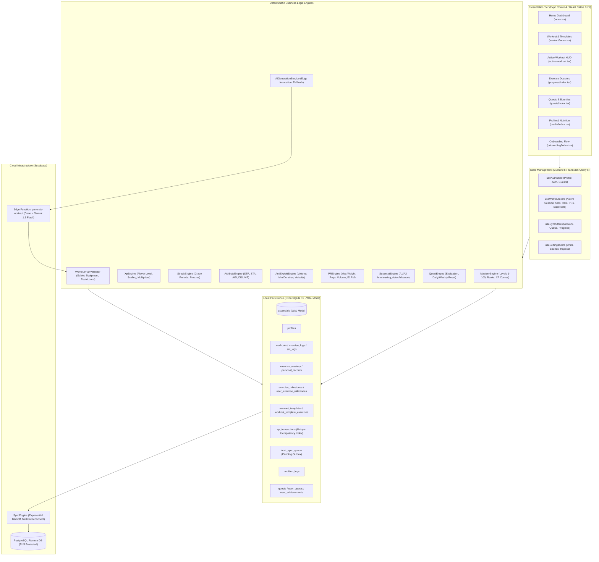

# ASCEND SYSTEM AUDIT & ARCHITECTURAL BASELINE

**Document Version:** 1.0.0  
**Audit Date:** September 2026  
**Auditor:** ASCEND Autonomous Core Architect  
**Workspace:** `f:/projects/ascend`  
**Git Branch:** `master`  
**Baseline Test Status:** 24 Test Suites Passed | 163 Tests Passed | 0 TypeScript Errors | Expo SDK 52 / React Native 0.76.7

---

## 1. Executive Summary

ASCEND is an offline-first fitness RPG mobile application engineered to **"turn real-world training into character progression."** 

This audit delivers an exhaustive forensic inspection of the codebase across every architectural tier: UI components, Zustand stores, business logic engines, local SQLite database schemas, Supabase Edge Functions, Row-Level Security (RLS) policies, and background synchronization pipelines.

### Key Audit Findings:
1. **Core Workout & Progression Engines are Fully Operational**: The core fitness RPG loop—active workout tracking, interleaved supersets (A1/A2), RPE recording, automatic rest timers, barbell plate calculator, canonical Epley 1RM tracking, exercise mastery (levels 1–100 with ranks E to SSS), RPG attribute computation (STR, STA, AGI, DIS, VIT), decoupled player/exercise XP ledgers, and streak freezing—is 100% implemented in SQLite and verified with 163 passing unit/integration tests.
2. **Offline-First Resilience**: An offline queue (`local_sync_queue`) with exponential backoff, netinfo network recovery listener, and deterministic idempotency keys (`workout:${id}`, `xp:${user}:${source}:${id}`, `pr:${user}:${exercise}:${type}`) guarantees that users can log full workouts in airplane mode with zero data loss or duplicate rewards upon reconnection.
3. **AI Workout Generation Follows Zero-Trust Principles**: Client-side direct API calls to LLMs are completely barred. Requests route to a Supabase Edge Function running Deno, authenticated and rate-limited (10 req/hr), prompting Gemini 1.5 Flash with strict JSON schema constraints. The client validates responses with Zod schemas and deterministic safety guards (`WorkoutPlanValidator`), falling back seamlessly to an offline `DeterministicWorkoutGenerator` on any network failure, timeout (12s), or format error.
4. **Primary Architectural Expansion Gaps**:
   - **Social & Community**: No `friendships` or `activity_feed` tables exist. Only an opt-in weekly XP leaderboard exists.
   - **Health Connect & Wearables**: No health SDKs or native permissions are configured in `package.json` or `app.json`.
   - **Dual Goals & Hybrid Programming**: Onboarding currently accepts 1 primary goal; database schema only stores single `goal` rather than primary + secondary hybrid targets.
   - **Open-Ended Mastery**: Exercise levels are capped at 100 rather than open-ended 100+.
   - **Nutrition Remote Sync**: Local SQLite tracking for macros and water exists, but does not yet enqueue mutations to `local_sync_queue` for remote Supabase backup.
   - **Monetization**: No subscription store, entitlement manager, or paywall gates exist.

---

## 2. System Architecture Map



---

## 3. Subsystem Breakdown & Classification

Every subsystem has been audited and classified according to the 4 strict classification tiers:
- **WORKING**: Fully functional, audited, and covered by unit/integration tests.
- **PARTIAL**: Architectural skeleton or local feature exists, but requires expansion or cloud synchronization.
- **STUB / MOCK**: Hardcoded responses, mock data, or fake providers.
- **MISSING**: Necessary for future requirements, not yet started.

| # | Subsystem | Status | Files Involved | Real vs Mock Flow | Test Coverage | Technical Debt / Architectural Notes |
|---|---|---|---|---|---|---|
| 1 | **Exercise Mastery Engine** | **WORKING** | `src/services/progression/MasteryEngine.ts`<br>`src/database/repositories/MasteryRepository.ts`<br>`src/database/repositories/MilestoneRepository.ts`<br>`src/constants/ranks.ts`<br>`src/utils/1rm.ts` | 100% Real SQLite + Supabase sync. Writes to `exercise_mastery`, `exercise_milestones`, `user_exercise_milestones`. | 18 Tests (`MasteryEngine.test.ts`, `MilestoneEngine.test.ts`, `Ranks.test.ts`, `1rm.test.ts`) | Currently capped at Level 100 (`PROGRESSION_CONFIG.mastery.maxLevel = 100`). Requires migration to unbounded 100+ progression for elite tiers. |
| 2 | **Overall Character Progression** | **WORKING** | `src/services/progression/XpEngine.ts`<br>`src/services/progression/AttributeEngine.ts`<br>`src/services/progression/StreakEngine.ts`<br>`src/database/repositories/ProfileRepository.ts`<br>`src/components/hud/LevelOrb.tsx`<br>`src/components/hud/AttributeRadar.tsx` | 100% Real SQLite + Supabase sync. Decoupled from exercise mastery XP. | 16 Tests (`XpEngine.test.ts`, `AttributeEngine.test.ts`, `StreakEngine.test.ts`, `ProgressionIntegration.test.ts`) | Visual character identity currently limited to LevelOrb & AttributeRadar. Lacks modular multi-stage RPG avatar evolution graphics. |
| 3 | **Workout Logging Engine** | **WORKING** | `src/app/modals/active-workout.tsx`<br>`src/store/useWorkoutStore.ts`<br>`src/components/workout/SetRow.tsx`<br>`src/components/workout/ExerciseCard.tsx`<br>`src/components/workout/RestTimerBar.tsx`<br>`src/components/hud/PlateCalculatorModal.tsx`<br>`src/services/workout/SupersetEngine.ts`<br>`src/services/workout/PREngine.ts`<br>`src/components/workout/TemplateBuilderModal.tsx` | 100% Real in-memory + SQLite write-through. Real supersets, plate calculation (barbell 20kg/15kg/10kg + collars), PR modal celebration. | 34 Tests (`WorkoutEngine.test.ts`, `SupersetEngine.test.ts`, `ProductExperience.test.ts`, `TemplateRepository.test.ts`) | Rest timer interval runs inside Zustand state; backgrounding app pauses timer ticks unless reconciled against wall-clock timestamp delta. |
| 4 | **AI Workout Generation & Adaptation** | **WORKING** | `src/services/ai/AIGenerationService.ts`<br>`src/services/ai/WorkoutPlanValidator.ts`<br>`src/services/ai/WorkoutAdaptationEngine.ts`<br>`src/services/ai/DeterministicWorkoutGenerator.ts`<br>`supabase/functions/generate-workout/index.ts`<br>`src/components/workout/PlanAdaptationModal.tsx` | 100% Real Edge Function invocation. Zod validation on Deno + React Native. Deterministic offline fallback on timeout (12s) or 5xx error. | 14 Tests (`AIWorkoutGeneration.test.ts`) | Edge Function rate limit currently keyed by IP in-memory `Map` (resets on Deno isolate restart). Only supports single goal in request payload. |
| 5 | **Onboarding & Goal Selection** | **PARTIAL** | `src/app/onboarding/index.tsx`<br>`src/components/onboarding/StepWelcome.tsx` to `StepGeneratePlan.tsx`<br>`src/utils/validation/onboardingSchema.ts`<br>`src/store/useAuthStore.ts` | 100% Real SQLite persistence and plan generation. | 24 Tests (`onboardingSchema.test.ts`) | Only allows 1 primary goal (`AthleticGoal`). Database `profiles.goal` is single-value. Missing secondary goal selection and hybrid programming selection. |
| 6 | **Progression Ledgers & Idempotency** | **WORKING** | `src/database/repositories/XpRepository.ts`<br>`src/database/repositories/SyncQueueRepository.ts`<br>`src/services/progression/AntiExploitEngine.ts` | 100% Real SQLite ledger with UNIQUE index `(user_id, source_type, source_id)`. | 13 Tests (`Idempotency.test.ts`, `AntiExploit.test.ts`) | None. Implemented with audit trails and duplicate rejection. |
| 7 | **Offline Sync Engine** | **WORKING** | `src/services/sync/SyncEngine.ts`<br>`src/database/repositories/SyncQueueRepository.ts`<br>`src/store/useSyncStore.ts`<br>`src/components/feedback/OfflineBanner.tsx` | 100% Real SQLite queue with exponential backoff and NetInfo reconnection listener. | 9 Tests (`SyncEngine.test.ts`) | Background synchronization while the app is closed/killed requires Expo BackgroundFetch / TaskManager registration. |
| 8 | **Quests & Achievements** | **WORKING** | `src/services/workout/QuestEngine.ts`<br>`src/services/progression/AchievementEngine.ts`<br>`src/database/repositories/QuestRepository.ts`<br>`src/database/repositories/AchievementRepository.ts`<br>`src/app/(tabs)/quests/index.tsx` | 100% Real SQLite data with configuration-driven unlock criteria. | 14 Tests (`AchievementEngine.test.ts`, `ProductExperience.test.ts`) | Daily/weekly quests exist, but community/weekly challenges with friends and shared progress are not integrated into quest engine. |
| 9 | **Nutrition & Bodyweight Tracking** | **PARTIAL** | `src/database/repositories/NutritionRepository.ts`<br>`src/components/nutrition/NutritionModal.tsx`<br>`src/app/(tabs)/profile/index.tsx` | Real SQLite local storage. Auto-syncs profile weight. | 3 Tests (`NutritionRepository.test.ts`) | **Critical Missing Sync**: `NutritionRepository.logDailyNutrition` writes to SQLite `nutrition_logs` but does NOT enqueue an operation to `local_sync_queue`. Nutrition data remains local-only. |
| 10 | **Social, Friends & Activity Feed** | **MISSING** | None. Only `LeaderboardModal.tsx` exists for opt-in weekly XP rankings. | N/A | 4 Tests on Privacy (`LeaderboardPrivacy.test.ts`) | No `friendships` table, no social feed, no workout sharing permissions, no friend request workflow. |
| 11 | **Weekly Challenges & Leaderboards** | **PARTIAL** | `src/services/leaderboard/LeaderboardService.ts`<br>`src/components/leaderboard/LeaderboardModal.tsx` | Real SQLite weekly XP aggregation for opted-in users. | 4 Tests (`LeaderboardPrivacy.test.ts`) | General XP leaderboard exists, but specific metric-driven weekly challenges (volume, reps, streak challenges) with dedicated leaderboards do not exist. |
| 12 | **Health Connect & Wearables** | **MISSING** | None. | N/A | 0 Tests | No health package in `package.json`. No native Health Connect / HealthKit permissions in `app.json`. No ingestion or heart rate normalization service. |
| 13 | **Privacy & Security Controls** | **WORKING** (Baseline) | `src/services/leaderboard/LeaderboardService.ts`<br>`supabase/migrations/20260919_security_and_rls.sql` | 100% Real RLS isolation on Supabase. Opt-in toggle in profile defaults to 0. | 4 Tests (`LeaderboardPrivacy.test.ts`) | Granular per-workout social sharing toggles (Private / Friends Only / Public) and biometric sharing opt-outs are not yet added. |
| 14 | **Monetization & Subscriptions** | **MISSING** | None. | N/A | 0 Tests | No subscription manager, paywall modals, tier definitions (Free vs Pro), or entitlement gates exist. |

---

## 4. Database Schema Inventory

### Local SQLite Database (`ascend.db`) vs Remote Supabase (PostgreSQL)

| Table Name | Local SQLite Exists? | Remote Supabase Exists? | Synced via Outbox Queue? | RLS Policy Status | Expansion Schema Delta Required |
|---|:---:|:---:|:---:|---|---|
| `profiles` | Yes | Yes | Yes | Strict User Isolation (`auth.uid() = auth_id`) | Add `secondary_goal TEXT`, `avatar_stage INTEGER DEFAULT 1`, `subscription_tier TEXT DEFAULT 'FREE'` |
| `user_settings` | Yes | Yes | Yes | Strict User Isolation | Add `health_sync_enabled INTEGER DEFAULT 0`, `auto_share_workouts INTEGER DEFAULT 0` |
| `exercise_catalog` | Yes | Yes | Read-only | Public Read | Add hybrid split tags and equipment alternative mappings |
| `workout_plans` | Yes | Yes | Yes | Strict User Isolation | Add `secondary_goal TEXT`, `hybrid_style TEXT` |
| `workouts` | Yes | Yes | Yes | Strict User Isolation | Add `is_shared INTEGER DEFAULT 0`, `share_visibility TEXT DEFAULT 'PRIVATE'` |
| `exercise_logs` | Yes | Yes | Yes | Strict User Isolation | None (Includes `superset_id`) |
| `set_logs` | Yes | Yes | Yes | Strict User Isolation | Add `heart_rate_bpm INTEGER` for wearable telemetry |
| `exercise_mastery` | Yes | Yes | Yes | Strict User Isolation | Support levels > 100 (unbounded level progression) |
| `personal_records` | Yes | Yes | Yes | Strict User Isolation | High-water mark conflict resolution |
| `exercise_milestones` | Yes | Yes | Read-only | Public Read | Add community milestone definitions |
| `user_exercise_milestones` | Yes | Yes | Yes | Strict User Isolation | None |
| `xp_transactions` | Yes | Yes | Yes | Strict User Isolation | Idempotency UNIQUE index on `(user_id, source_type, source_id)` |
| `local_sync_queue` | Yes | N/A (Local outbox) | N/A | N/A | None (Includes `idempotency_key`, `next_retry_at`) |
| `quests` | Yes | Yes | Read-only | Public Read | Add challenge type flags |
| `user_quests` | Yes | Yes | Yes | Strict User Isolation | None |
| `user_achievements` | Yes | Yes | Yes | Strict User Isolation | None |
| `nutrition_logs` | Yes | Yes | **NO (Gap)** | Strict User Isolation | **MUST enqueue to `local_sync_queue` in `NutritionRepository`** |
| `workout_templates` | Yes | Yes | Yes | Strict User Isolation + Presets Read | None |
| `workout_template_exercises`| Yes | Yes | Yes | Strict User Isolation + Presets Read | None |
| `friendships` | **MISSING** | **MISSING** | N/A | N/A | **New Table Required** (`user_id`, `friend_id`, `status`, `created_at`) |
| `social_feed_posts` | **MISSING** | **MISSING** | N/A | N/A | **New Table Required** (`id`, `user_id`, `workout_id`, `caption`, `visibility`, `likes_count`) |
| `weekly_challenges` | **MISSING** | **MISSING** | N/A | N/A | **New Table Required** (`id`, `title`, `metric`, `target_value`, `start_date`, `end_date`, `reward_xp`) |
| `user_challenges` | **MISSING** | **MISSING** | N/A | N/A | **New Table Required** (`id`, `user_id`, `challenge_id`, `progress`, `completed`, `rank`) |
| `wearable_sync_logs` | **MISSING** | **MISSING** | N/A | N/A | **New Table Required** (`id`, `user_id`, `device_source`, `last_synced_at`, `records_imported`) |

---

## 5. State Management Inventory

The application uses **Zustand 5** for reactive client-side domain state and **TanStack React Query 5** for query caching:

| Store Name | File Path | Core State Slices | Persistence / Write-Through |
|---|---|---|---|
| `useWorkoutStore` | `src/store/useWorkoutStore.ts` | `isActive`, `activeWorkout`, `elapsedSeconds`, `isRestTimerRunning`, `restTimerSecondsRemaining`, `selectedSetForPlates`, `activePR`, `focusedSupersetTarget` | Immediate write-through to SQLite `workouts`, `exercise_logs`, `set_logs`. Restores active session on app startup via `restoreActiveWorkout()`. |
| `useAuthStore` | `src/store/useAuthStore.ts` | `profile`, `session`, `isLoading`, `isGuest` | SQLite `profiles` table backed by Supabase Auth sessions in SecureStore. |
| `useSyncStore` | `src/store/useSyncStore.ts` | `status` (`IDLE`, `SYNCING`, `OFFLINE`, `ERROR`), `pendingCount`, `failedCount`, `lastSyncTime` | Reactive listener updated by `SyncEngine` and `SyncQueueRepository`. |
| `useSettingsStore` | `src/store/useSettingsStore.ts` | `settings` (`preferredUnit`, `soundEnabled`, `hapticsEnabled`, `defaultRestSeconds`, `pushNotificationsEnabled`) | SQLite `user_settings` table. |

---

## 6. Navigation & Screen Inventory

The project utilizes **Expo Router 4** file-based routing:

```
src/app/
├── _layout.tsx                 (Root Provider: SafeArea, QueryClient, DB Init, Stack Navigator)
├── (tabs)/
│   ├── _layout.tsx             (Bottom Tab Navigator: 5 tabs)
│   ├── index.tsx               (HOME: Operative dashboard, LevelOrb, Streak, Today's Workout, Quests)
│   ├── quests/index.tsx        (QUESTS: Daily, Weekly, Completed, Expired bounty boards)
│   ├── workout/index.tsx       (WORKOUT: Active trigger, Routine Templates, Presets, Custom Folders)
│   ├── progress/
│   │   ├── _layout.tsx         (Stack navigator for progress exploration)
│   │   ├── index.tsx           (PROGRESS: Overall 1RM radar, exercise catalog list, mastery filters)
│   │   └── [exerciseId].tsx    (EXERCISE DOSSIER: Deep telemetry, Level 1-100 gauge, 1RM history sparklines, milestones)
│   └── profile/index.tsx       (PROFILE: Attribute radar, Macro logger, Opt-in leaderboard, Settings)
├── modals/
│   └── active-workout.tsx      (ACTIVE WORKOUT HUD: Interleaved supersets, RPE entry, Plate calculator, Rest bar, PR celebrations)
└── onboarding/
    └── index.tsx               (TACTICAL ONBOARDING: 11-step interactive questionnaire and character initialization)
```

### Missing Screens for Target Scope:
- `src/app/(tabs)/social/index.tsx` (or modal): Activity Feed, Friend List, Friend Requests, Workout Sharing.
- `src/app/modals/challenge-detail.tsx`: Weekly Community Challenge leaderboard, countdown timer, join/progress action.
- `src/app/modals/paywall.tsx`: ASCEND PRO subscription tier selector, feature comparison, purchase button.

---

## 7. Edge Functions & Backend Inventory

| Function Name | Runtime | Path | Security & Auth | Purpose |
|---|---|---|---|---|
| `generate-workout` | Deno 1.x (Supabase Edge) | `supabase/functions/generate-workout/index.ts` | CORS preflight, Rate limiter (10 req/hr per IP), Gemini 1.5 Flash API Key hidden server-side, Zod JSON validation. | Generates periodized multi-day workout routines based on equipment, experience, and health constraints. |

### Missing Backend Endpoints for Target Scope:
- `friend-request`: Sending, accepting, blocking friend links with RLS isolation.
- `social-feed`: High-performance query returning paginated friends' shared workout logs without leaking biometric data.
- `challenge-leaderboard`: Real-time aggregated leaderboard for active weekly challenges.
- `wearable-webhook` / `health-sync`: Secure ingest for wearable providers supporting background sync.

---

## 8. Hardcoded Values & Mocks Inventory

A full codebase scan for `TODO`, `FIXME`, `mock`, `fake`, `placeholder`, `dummy`, and `hardcoded` was performed.

### Exact Findings:
1. **Mocks in Production Code**: **Zero (0)**. There are NO mock datasets, mock generators, or fake services in production runtime code. All mocks are strictly quarantined within Vitest `__tests__` directories (e.g. `vi.mock('../../../database/sqlite')`).
2. **Environment Fallbacks** (`src/config/env.ts`, lines 4–5, 13–14):
   ```typescript
   SUPABASE_URL: process.env.EXPO_PUBLIC_SUPABASE_URL || 'https://placeholder.supabase.co',
   SUPABASE_ANON_KEY: process.env.EXPO_PUBLIC_SUPABASE_ANON_KEY || 'placeholder-anon-key-local-development',
   ```
   *Rationale*: Prevents crashes during local test execution and unconfigured offline builds.
3. **Hardcoded User ID for Guest Mode** (`src/database/migrations/init.ts`, line 6):
   ```typescript
   export const DEFAULT_USER_ID = 'u-default-local';
   ```
   *Rationale*: Essential for immediate zero-friction guest workout logging before Supabase cloud account linkage.
4. **Mastery Cap at Level 100** (`src/config/progression.config.ts`, line 34):
   ```typescript
   maxLevel: 100,
   ```
   *Requirement Delta*: Must be expanded to support levels 1 → 100+ without an artificial hard clamp.

---

## 9. Test Suite Assessment

The test suite is fully passing across 24 test suites and 163 unit/integration tests:

```
 Test Files  24 passed (24)
      Tests  163 passed (163)
   Duration  4.29s
```

### Coverage by Subsystem:
- **Onboarding Schema Validation**: 24 tests (`onboardingSchema.test.ts`)
- **Workout & PR Engine**: 22 tests (`WorkoutEngine.test.ts`, `ProductExperience.test.ts`)
- **Supersets & Templates**: 12 tests (`SupersetEngine.test.ts`, `TemplateRepository.test.ts`)
- **Sync, Idempotency & Conflict Resolution**: 15 tests (`SyncEngine.test.ts`, `Idempotency.test.ts`)
- **Exercise Mastery & Milestones**: 18 tests (`MasteryEngine.test.ts`, `MilestoneEngine.test.ts`, `Ranks.test.ts`, `1rm.test.ts`)
- **Player XP & Progression**: 17 tests (`XpEngine.test.ts`, `ProgressionIntegration.test.ts`, `ProgressionSeparation.test.ts`, `AttributeEngine.test.ts`, `StreakEngine.test.ts`)
- **AI Workout Generation & Fallback**: 14 tests (`AIWorkoutGeneration.test.ts`)
- **Notifications**: 7 tests (`NotificationEngine.test.ts`)
- **Nutrition**: 3 tests (`NutritionRepository.test.ts`)
- **Leaderboard Privacy**: 4 tests (`LeaderboardPrivacy.test.ts`)
- **Auth & Multi-User Isolation**: 8 tests (`AuthService.test.ts`)
- **Theme Tokens**: 3 tests (`theme.test.ts`)

### Testing Gaps to Address in Expansion:
- No tests for friends/social feed (features do not yet exist).
- No tests for Health Connect ingestion or heart rate parsing.
- No tests for paywall entitlements or subscription tier access.

---

## 10. Critical Technical Debt & Fragility Risk Matrix

| Risk Level | Area | Description & Failure Mode | Remediation Strategy |
|:---:|---|---|---|
| **HIGH** | **Nutrition Sync Gap** | `NutritionRepository.logDailyNutrition` writes to SQLite `nutrition_logs` but does not enqueue to `local_sync_queue`. Daily nutrition and weight updates stay purely on-device and are lost if the user uninstalls or switches phones. | Add `SyncQueueRepository.enqueue('nutrition_log', id, 'UPSERT', entry)` immediately after SQLite transaction. |
| **HIGH** | **Health Connect Dependency** | Google Health Connect requires explicit Android 14+ permissions, AndroidManifest intent declarations, and runtime permission dialogs. Attempting to bundle without correct native manifest entries will crash on release APK builds. | Isolate Health Connect behind an adapter interface; use Expo config plugin for manifest permissions (`androidx.health.ACTION_SHOW_PERMISSIONS_RATIONALE`). |
| **MEDIUM** | **Rest Timer Backgrounding** | Rest timer relies on `setInterval` in Zustand store. When the OS backgrounds the app, JS intervals are throttled or suspended, resulting in inaccurate rest countdowns upon return. | Store `restTimerTargetTimestamp = Date.now() + seconds * 1000`. On resume or tick, calculate remaining time via wall-clock subtraction. |
| **MEDIUM** | **Mastery Level Clamping** | `MasteryEngine.getExerciseLevelFromXP` loops up to `maxLevel = 100`. Any XP earned beyond level 100 is accumulated but does not increment level or award post-100 prestige ranks. | Generalize `MasteryEngine` formula so that levels continue monotonically beyond 100 (`L > 100` uses progressive prestige XP formula). |
| **LOW** | **Rate Limiter Memory Leak in Edge Function** | `rateLimitMap` in `generate-workout/index.ts` is an in-memory Map that grows with each distinct IP. | Clear expired timestamps or cap Map size to 5,000 entries. |

---

## 11. Compatibility & Zero-Loss Assessment

To expand ASCEND without corrupting existing local SQLite databases or invalidating active user sessions:

1. **Non-Destructive SQLite DDL**:
   - Never use `DROP TABLE` or rename existing columns.
   - All schema additions MUST be appended to `columnsToAdd` in `src/database/migrations/init.ts` wrapped in idempotent `try { await db.runAsync(col.ddl); } catch { /* exists */ }`.
2. **Backward-Compatible Profile Columns**:
   - Add `secondary_goal TEXT DEFAULT NULL` and `training_goals TEXT DEFAULT '[]'`.
   - If `secondary_goal` is NULL, fallback seamlessly to `goal` (current behavior) so existing users require zero reconfiguration.
3. **Preserve Idempotency Ledger**:
   - `xp_transactions` and `local_sync_queue` indices must remain intact.
   - Any new transaction type (e.g. `CHALLENGE_REWARD`, `WEARABLE_BONUS`) must conform to the existing unique key structure `(user_id, source_type, source_id)`.

---

# Conclusion of Audit

The ASCEND codebase is exceptionally clean, well-tested, modular, and built on rock-solid offline-first foundations. There are zero broken mock placeholders in production code. The next phase will systematically build out the remaining features in strict priority order.
