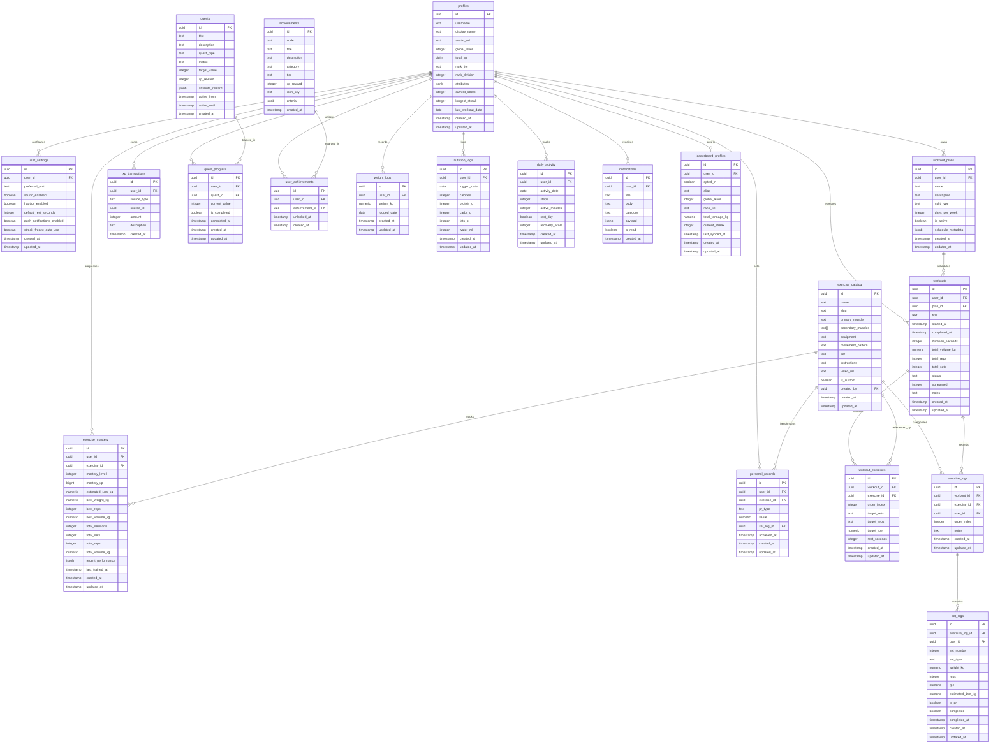

# ASCEND — Database Architecture & Schema Specification

## 1. Architectural Overview & Entity Relationship Diagram

ASCEND uses a normalized relational architecture powered by **PostgreSQL 16** on Supabase and mirrored locally via **Expo SQLite**.

### 1.1 Mermaid Entity Relationship Diagram



---

## 2. Table Specifications & DDL

### 2.1 Profiles & User Settings
```sql
-- Enable UUID extension
CREATE EXTENSION IF NOT EXISTS "uuid-ossp";

CREATE TABLE profiles (
    id UUID PRIMARY KEY REFERENCES auth.users(id) ON DELETE CASCADE,
    username TEXT UNIQUE NOT NULL,
    display_name TEXT NOT NULL,
    avatar_url TEXT,
    global_level INTEGER NOT NULL DEFAULT 1,
    total_xp BIGINT NOT NULL DEFAULT 0,
    rank_tier TEXT NOT NULL DEFAULT 'INITIATE', -- INITIATE, ADEPT, VANGUARD, CENTURION, SOVEREIGN, ASCENDANT
    rank_division INTEGER NOT NULL DEFAULT 1,    -- 1 to 4
    attributes JSONB NOT NULL DEFAULT '{"strength": 10, "stamina": 10, "agility": 10, "discipline": 10, "vitality": 10}'::jsonb,
    current_streak INTEGER NOT NULL DEFAULT 0,
    longest_streak INTEGER NOT NULL DEFAULT 0,
    streak_freeze_tokens INTEGER NOT NULL DEFAULT 1,
    last_workout_date DATE,
    created_at TIMESTAMPTZ NOT NULL DEFAULT NOW(),
    updated_at TIMESTAMPTZ NOT NULL DEFAULT NOW()
);

CREATE TABLE user_settings (
    id UUID PRIMARY KEY DEFAULT uuid_generate_v4(),
    user_id UUID NOT NULL UNIQUE REFERENCES profiles(id) ON DELETE CASCADE,
    preferred_unit TEXT NOT NULL DEFAULT 'kg' CHECK (preferred_unit IN ('kg', 'lbs')),
    sound_enabled BOOLEAN NOT NULL DEFAULT TRUE,
    haptics_enabled BOOLEAN NOT NULL DEFAULT TRUE,
    default_rest_seconds INTEGER NOT NULL DEFAULT 90,
    push_notifications_enabled BOOLEAN NOT NULL DEFAULT TRUE,
    streak_freeze_auto_use BOOLEAN NOT NULL DEFAULT TRUE,
    created_at TIMESTAMPTZ NOT NULL DEFAULT NOW(),
    updated_at TIMESTAMPTZ NOT NULL DEFAULT NOW()
);
```

### 2.2 Exercise Catalog & Mastery
```sql
CREATE TABLE exercise_catalog (
    id UUID PRIMARY KEY DEFAULT uuid_generate_v4(),
    name TEXT NOT NULL,
    slug TEXT UNIQUE NOT NULL,
    primary_muscle TEXT NOT NULL,
    secondary_muscles TEXT[] DEFAULT '{}',
    equipment TEXT NOT NULL, -- Barbell, Dumbbell, Cable, Machine, Bodyweight, etc.
    movement_pattern TEXT NOT NULL, -- Squat, Hinge, Push, Pull, Carry, Lunge, Isolation
    tier TEXT NOT NULL DEFAULT 'STANDARD', -- COMPOUND_PRIMARY, COMPOUND_SECONDARY, ACCESSORY, ISOLATION
    instructions TEXT,
    video_url TEXT,
    is_custom BOOLEAN NOT NULL DEFAULT FALSE,
    created_by UUID REFERENCES profiles(id) ON DELETE SET NULL,
    created_at TIMESTAMPTZ NOT NULL DEFAULT NOW(),
    updated_at TIMESTAMPTZ NOT NULL DEFAULT NOW()
);

CREATE TABLE exercise_mastery (
    id UUID PRIMARY KEY DEFAULT uuid_generate_v4(),
    user_id UUID NOT NULL REFERENCES profiles(id) ON DELETE CASCADE,
    exercise_id UUID NOT NULL REFERENCES exercise_catalog(id) ON DELETE CASCADE,
    mastery_level INTEGER NOT NULL DEFAULT 1,
    mastery_xp BIGINT NOT NULL DEFAULT 0,
    estimated_1rm_kg NUMERIC(6,2) NOT NULL DEFAULT 0.00,
    best_weight_kg NUMERIC(6,2) NOT NULL DEFAULT 0.00,
    best_reps INTEGER NOT NULL DEFAULT 0,
    best_volume_kg NUMERIC(8,2) NOT NULL DEFAULT 0.00,
    total_sessions INTEGER NOT NULL DEFAULT 0,
    total_sets INTEGER NOT NULL DEFAULT 0,
    total_reps INTEGER NOT NULL DEFAULT 0,
    total_volume_kg NUMERIC(10,2) NOT NULL DEFAULT 0.00,
    recent_performance JSONB NOT NULL DEFAULT '[]'::jsonb,
    last_trained_at TIMESTAMPTZ,
    created_at TIMESTAMPTZ NOT NULL DEFAULT NOW(),
    updated_at TIMESTAMPTZ NOT NULL DEFAULT NOW(),
    CONSTRAINT uq_user_exercise_mastery UNIQUE (user_id, exercise_id)
);
```

### 2.3 Workouts, Logs & Sets
```sql
CREATE TABLE workout_plans (
    id UUID PRIMARY KEY DEFAULT uuid_generate_v4(),
    user_id UUID NOT NULL REFERENCES profiles(id) ON DELETE CASCADE,
    name TEXT NOT NULL,
    description TEXT,
    split_type TEXT NOT NULL, -- PPL, UPPER_LOWER, FULL_BODY, BRO_SPLIT, CUSTOM
    days_per_week INTEGER NOT NULL DEFAULT 4,
    is_active BOOLEAN NOT NULL DEFAULT FALSE,
    schedule_metadata JSONB NOT NULL DEFAULT '{}'::jsonb,
    created_at TIMESTAMPTZ NOT NULL DEFAULT NOW(),
    updated_at TIMESTAMPTZ NOT NULL DEFAULT NOW()
);

CREATE TABLE workouts (
    id UUID PRIMARY KEY DEFAULT uuid_generate_v4(),
    user_id UUID NOT NULL REFERENCES profiles(id) ON DELETE CASCADE,
    plan_id UUID REFERENCES workout_plans(id) ON DELETE SET NULL,
    title TEXT NOT NULL,
    started_at TIMESTAMPTZ NOT NULL,
    completed_at TIMESTAMPTZ,
    duration_seconds INTEGER DEFAULT 0,
    total_volume_kg NUMERIC(10,2) NOT NULL DEFAULT 0.00,
    total_reps INTEGER NOT NULL DEFAULT 0,
    total_sets INTEGER NOT NULL DEFAULT 0,
    status TEXT NOT NULL DEFAULT 'COMPLETED' CHECK (status IN ('ACTIVE', 'COMPLETED', 'DISCARDED')),
    xp_earned INTEGER NOT NULL DEFAULT 0,
    notes TEXT,
    created_at TIMESTAMPTZ NOT NULL DEFAULT NOW(),
    updated_at TIMESTAMPTZ NOT NULL DEFAULT NOW()
);

CREATE TABLE workout_exercises (
    id UUID PRIMARY KEY DEFAULT uuid_generate_v4(),
    workout_id UUID NOT NULL REFERENCES workouts(id) ON DELETE CASCADE,
    exercise_id UUID NOT NULL REFERENCES exercise_catalog(id) ON DELETE RESTRICT,
    order_index INTEGER NOT NULL DEFAULT 0,
    target_sets TEXT,
    target_reps TEXT,
    target_rpe NUMERIC(3,1),
    rest_seconds INTEGER DEFAULT 90,
    created_at TIMESTAMPTZ NOT NULL DEFAULT NOW(),
    updated_at TIMESTAMPTZ NOT NULL DEFAULT NOW()
);

CREATE TABLE exercise_logs (
    id UUID PRIMARY KEY DEFAULT uuid_generate_v4(),
    workout_id UUID NOT NULL REFERENCES workouts(id) ON DELETE CASCADE,
    exercise_id UUID NOT NULL REFERENCES exercise_catalog(id) ON DELETE RESTRICT,
    user_id UUID NOT NULL REFERENCES profiles(id) ON DELETE CASCADE,
    order_index INTEGER NOT NULL DEFAULT 0,
    notes TEXT,
    created_at TIMESTAMPTZ NOT NULL DEFAULT NOW(),
    updated_at TIMESTAMPTZ NOT NULL DEFAULT NOW()
);

CREATE TABLE set_logs (
    id UUID PRIMARY KEY DEFAULT uuid_generate_v4(),
    exercise_log_id UUID NOT NULL REFERENCES exercise_logs(id) ON DELETE CASCADE,
    user_id UUID NOT NULL REFERENCES profiles(id) ON DELETE CASCADE,
    set_number INTEGER NOT NULL,
    set_type TEXT NOT NULL DEFAULT 'NORMAL' CHECK (set_type IN ('WARMUP', 'NORMAL', 'DROP', 'FAILURE')),
    weight_kg NUMERIC(6,2) NOT NULL DEFAULT 0.00,
    reps INTEGER NOT NULL DEFAULT 0,
    rpe NUMERIC(3,1),
    estimated_1rm_kg NUMERIC(6,2) NOT NULL DEFAULT 0.00,
    is_pr BOOLEAN NOT NULL DEFAULT FALSE,
    completed BOOLEAN NOT NULL DEFAULT TRUE,
    completed_at TIMESTAMPTZ NOT NULL DEFAULT NOW(),
    created_at TIMESTAMPTZ NOT NULL DEFAULT NOW(),
    updated_at TIMESTAMPTZ NOT NULL DEFAULT NOW()
);
```

### 2.4 Progression, PRs & Quests
```sql
CREATE TABLE xp_transactions (
    id UUID PRIMARY KEY DEFAULT uuid_generate_v4(),
    user_id UUID NOT NULL REFERENCES profiles(id) ON DELETE CASCADE,
    source_type TEXT NOT NULL, -- SET_COMPLETION, WORKOUT_COMPLETION, PR_BROKEN, QUEST_COMPLETED, STREAK_BONUS
    source_id UUID,
    amount INTEGER NOT NULL,
    description TEXT NOT NULL,
    created_at TIMESTAMPTZ NOT NULL DEFAULT NOW()
);

CREATE TABLE personal_records (
    id UUID PRIMARY KEY DEFAULT uuid_generate_v4(),
    user_id UUID NOT NULL REFERENCES profiles(id) ON DELETE CASCADE,
    exercise_id UUID NOT NULL REFERENCES exercise_catalog(id) ON DELETE CASCADE,
    pr_type TEXT NOT NULL CHECK (pr_type IN ('MAX_WEIGHT', 'MAX_REPS', 'MAX_VOLUME', 'MAX_ESTIMATED_1RM')),
    value NUMERIC(8,2) NOT NULL,
    set_log_id UUID REFERENCES set_logs(id) ON DELETE SET NULL,
    achieved_at TIMESTAMPTZ NOT NULL DEFAULT NOW(),
    created_at TIMESTAMPTZ NOT NULL DEFAULT NOW(),
    updated_at TIMESTAMPTZ NOT NULL DEFAULT NOW(),
    CONSTRAINT uq_user_exercise_pr_type UNIQUE (user_id, exercise_id, pr_type)
);

CREATE TABLE quests (
    id UUID PRIMARY KEY DEFAULT uuid_generate_v4(),
    title TEXT NOT NULL,
    description TEXT NOT NULL,
    quest_type TEXT NOT NULL CHECK (quest_type IN ('DAILY', 'WEEKLY', 'CAMPAIGN')),
    metric TEXT NOT NULL, -- WORKOUT_COUNT, TOTAL_TONNAGE, EXERCISE_REPS, PR_COUNT, RECOVERY_REST
    target_value INTEGER NOT NULL,
    xp_reward INTEGER NOT NULL,
    attribute_reward JSONB DEFAULT '{}'::jsonb,
    active_from TIMESTAMPTZ NOT NULL,
    active_until TIMESTAMPTZ NOT NULL,
    created_at TIMESTAMPTZ NOT NULL DEFAULT NOW()
);

CREATE TABLE quest_progress (
    id UUID PRIMARY KEY DEFAULT uuid_generate_v4(),
    user_id UUID NOT NULL REFERENCES profiles(id) ON DELETE CASCADE,
    quest_id UUID NOT NULL REFERENCES quests(id) ON DELETE CASCADE,
    current_value INTEGER NOT NULL DEFAULT 0,
    is_completed BOOLEAN NOT NULL DEFAULT FALSE,
    completed_at TIMESTAMPTZ,
    created_at TIMESTAMPTZ NOT NULL DEFAULT NOW(),
    updated_at TIMESTAMPTZ NOT NULL DEFAULT NOW(),
    CONSTRAINT uq_user_quest UNIQUE (user_id, quest_id)
);

CREATE TABLE achievements (
    id UUID PRIMARY KEY DEFAULT uuid_generate_v4(),
    code TEXT UNIQUE NOT NULL,
    title TEXT NOT NULL,
    description TEXT NOT NULL,
    category TEXT NOT NULL, -- STRENGTH, CONSISTENCY, MASTERY, DEDICATION, SPECIAL
    tier TEXT NOT NULL DEFAULT 'BRONZE' CHECK (tier IN ('BRONZE', 'SILVER', 'GOLD', 'PLATINUM', 'ASCENDANT')),
    xp_reward INTEGER NOT NULL DEFAULT 250,
    icon_key TEXT NOT NULL,
    criteria JSONB NOT NULL,
    created_at TIMESTAMPTZ NOT NULL DEFAULT NOW()
);

CREATE TABLE user_achievements (
    id UUID PRIMARY KEY DEFAULT uuid_generate_v4(),
    user_id UUID NOT NULL REFERENCES profiles(id) ON DELETE CASCADE,
    achievement_id UUID NOT NULL REFERENCES achievements(id) ON DELETE CASCADE,
    unlocked_at TIMESTAMPTZ NOT NULL DEFAULT NOW(),
    created_at TIMESTAMPTZ NOT NULL DEFAULT NOW(),
    CONSTRAINT uq_user_achievement UNIQUE (user_id, achievement_id)
);
```

### 2.5 Health, Activity, & Leaderboards
```sql
CREATE TABLE weight_logs (
    id UUID PRIMARY KEY DEFAULT uuid_generate_v4(),
    user_id UUID NOT NULL REFERENCES profiles(id) ON DELETE CASCADE,
    weight_kg NUMERIC(5,2) NOT NULL,
    logged_date DATE NOT NULL,
    created_at TIMESTAMPTZ NOT NULL DEFAULT NOW(),
    updated_at TIMESTAMPTZ NOT NULL DEFAULT NOW(),
    CONSTRAINT uq_user_weight_date UNIQUE (user_id, logged_date)
);

CREATE TABLE nutrition_logs (
    id UUID PRIMARY KEY DEFAULT uuid_generate_v4(),
    user_id UUID NOT NULL REFERENCES profiles(id) ON DELETE CASCADE,
    logged_date DATE NOT NULL,
    calories INTEGER,
    protein_g INTEGER,
    carbs_g INTEGER,
    fats_g INTEGER,
    water_ml INTEGER,
    created_at TIMESTAMPTZ NOT NULL DEFAULT NOW(),
    updated_at TIMESTAMPTZ NOT NULL DEFAULT NOW(),
    CONSTRAINT uq_user_nutrition_date UNIQUE (user_id, logged_date)
);

CREATE TABLE daily_activity (
    id UUID PRIMARY KEY DEFAULT uuid_generate_v4(),
    user_id UUID NOT NULL REFERENCES profiles(id) ON DELETE CASCADE,
    activity_date DATE NOT NULL,
    steps INTEGER DEFAULT 0,
    active_minutes INTEGER DEFAULT 0,
    rest_day BOOLEAN NOT NULL DEFAULT FALSE,
    recovery_score INTEGER CHECK (recovery_score BETWEEN 0 AND 100),
    created_at TIMESTAMPTZ NOT NULL DEFAULT NOW(),
    updated_at TIMESTAMPTZ NOT NULL DEFAULT NOW(),
    CONSTRAINT uq_user_activity_date UNIQUE (user_id, activity_date)
);

CREATE TABLE notifications (
    id UUID PRIMARY KEY DEFAULT uuid_generate_v4(),
    user_id UUID NOT NULL REFERENCES profiles(id) ON DELETE CASCADE,
    title TEXT NOT NULL,
    body TEXT NOT NULL,
    category TEXT NOT NULL, -- STREAK_WARNING, QUEST_AVAILABLE, LEVEL_UP, ACHIEVEMENT
    payload JSONB DEFAULT '{}'::jsonb,
    is_read BOOLEAN NOT NULL DEFAULT FALSE,
    created_at TIMESTAMPTZ NOT NULL DEFAULT NOW()
);

CREATE TABLE leaderboard_profiles (
    id UUID PRIMARY KEY DEFAULT uuid_generate_v4(),
    user_id UUID NOT NULL UNIQUE REFERENCES profiles(id) ON DELETE CASCADE,
    opted_in BOOLEAN NOT NULL DEFAULT FALSE,
    alias TEXT NOT NULL,
    global_level INTEGER NOT NULL,
    rank_tier TEXT NOT NULL,
    total_tonnage_kg NUMERIC(12,2) NOT NULL DEFAULT 0.00,
    current_streak INTEGER NOT NULL DEFAULT 0,
    last_synced_at TIMESTAMPTZ NOT NULL DEFAULT NOW(),
    created_at TIMESTAMPTZ NOT NULL DEFAULT NOW(),
    updated_at TIMESTAMPTZ NOT NULL DEFAULT NOW()
);
```

---

## 3. Row-Level Security (RLS) Policies

All tables containing user-specific data have RLS enabled. Read and write operations are strictly restricted to authenticated users matching `auth.uid() = user_id`.

```sql
-- Enable RLS on all tables
ALTER TABLE profiles ENABLE ROW LEVEL SECURITY;
ALTER TABLE user_settings ENABLE ROW LEVEL SECURITY;
ALTER TABLE exercise_catalog ENABLE ROW LEVEL SECURITY;
ALTER TABLE exercise_mastery ENABLE ROW LEVEL SECURITY;
ALTER TABLE workout_plans ENABLE ROW LEVEL SECURITY;
ALTER TABLE workouts ENABLE ROW LEVEL SECURITY;
ALTER TABLE workout_exercises ENABLE ROW LEVEL SECURITY;
ALTER TABLE exercise_logs ENABLE ROW LEVEL SECURITY;
ALTER TABLE set_logs ENABLE ROW LEVEL SECURITY;
ALTER TABLE xp_transactions ENABLE ROW LEVEL SECURITY;
ALTER TABLE personal_records ENABLE ROW LEVEL SECURITY;
ALTER TABLE quests ENABLE ROW LEVEL SECURITY;
ALTER TABLE quest_progress ENABLE ROW LEVEL SECURITY;
ALTER TABLE achievements ENABLE ROW LEVEL SECURITY;
ALTER TABLE user_achievements ENABLE ROW LEVEL SECURITY;
ALTER TABLE weight_logs ENABLE ROW LEVEL SECURITY;
ALTER TABLE nutrition_logs ENABLE ROW LEVEL SECURITY;
ALTER TABLE daily_activity ENABLE ROW LEVEL SECURITY;
ALTER TABLE notifications ENABLE ROW LEVEL SECURITY;
ALTER TABLE leaderboard_profiles ENABLE ROW LEVEL SECURITY;

-- 1. Profiles: Users can read and update only their own profile
CREATE POLICY "Users can view their own profile"
    ON profiles FOR SELECT USING (auth.uid() = id);

CREATE POLICY "Users can update their own profile"
    ON profiles FOR UPDATE USING (auth.uid() = id);

-- 2. User Settings: Strict tenant isolation
CREATE POLICY "Users can manage their own settings"
    ON user_settings FOR ALL USING (auth.uid() = user_id);

-- 3. Exercise Catalog: Anyone authenticated can view system exercises, users can manage custom exercises
CREATE POLICY "Public system exercises are readable by all"
    ON exercise_catalog FOR SELECT USING (is_custom = FALSE OR created_by = auth.uid());

CREATE POLICY "Users can insert custom exercises"
    ON exercise_catalog FOR INSERT WITH CHECK (auth.uid() = created_by AND is_custom = TRUE);

-- 4. Workouts & Logs: Strict user ownership
CREATE POLICY "Users own their workout plans"
    ON workout_plans FOR ALL USING (auth.uid() = user_id);

CREATE POLICY "Users own their workouts"
    ON workouts FOR ALL USING (auth.uid() = user_id);

CREATE POLICY "Users own their exercise logs"
    ON exercise_logs FOR ALL USING (auth.uid() = user_id);

CREATE POLICY "Users own their set logs"
    ON set_logs FOR ALL USING (auth.uid() = user_id);

CREATE POLICY "Users own their mastery records"
    ON exercise_mastery FOR ALL USING (auth.uid() = user_id);

CREATE POLICY "Users own their personal records"
    ON personal_records FOR ALL USING (auth.uid() = user_id);

CREATE POLICY "Users own their XP transactions"
    ON xp_transactions FOR ALL USING (auth.uid() = user_id);

CREATE POLICY "Users own their quest progress"
    ON quest_progress FOR ALL USING (auth.uid() = user_id);

CREATE POLICY "Users own their achievements"
    ON user_achievements FOR ALL USING (auth.uid() = user_id);

CREATE POLICY "Users own their weight logs"
    ON weight_logs FOR ALL USING (auth.uid() = user_id);

CREATE POLICY "Users own their nutrition logs"
    ON nutrition_logs FOR ALL USING (auth.uid() = user_id);

CREATE POLICY "Users own their daily activity"
    ON daily_activity FOR ALL USING (auth.uid() = user_id);

CREATE POLICY "Users own their notifications"
    ON notifications FOR ALL USING (auth.uid() = user_id);

-- 5. Quests & Achievements Catalog: Readable by all authenticated users
CREATE POLICY "Quests readable by all authenticated"
    ON quests FOR SELECT TO authenticated USING (TRUE);

CREATE POLICY "Achievements readable by all authenticated"
    ON achievements FOR SELECT TO authenticated USING (TRUE);

-- 6. Leaderboards: Opt-In Public Read Policy
CREATE POLICY "Only opted-in profiles are visible on leaderboard"
    ON leaderboard_profiles FOR SELECT
    TO authenticated
    USING (opted_in = TRUE);

CREATE POLICY "Users can manage their own leaderboard entry"
    ON leaderboard_profiles FOR ALL
    USING (auth.uid() = user_id);
```

---

## 4. Local SQLite Table: `sync_queue`

In Expo SQLite, an additional table stores queued sync operations while the client is offline:

```sql
CREATE TABLE IF NOT EXISTS local_sync_queue (
    id TEXT PRIMARY KEY,               -- UUID string
    entity_type TEXT NOT NULL,        -- 'workout', 'set_log', 'exercise_mastery', etc.
    entity_id TEXT NOT NULL,          -- Target row UUID
    operation TEXT NOT NULL,          -- 'INSERT', 'UPDATE', 'DELETE'
    payload TEXT NOT NULL,            -- JSON serialized entity
    client_timestamp INTEGER NOT NULL,-- Unix epoch millis
    attempts INTEGER NOT NULL DEFAULT 0,
    last_error TEXT,
    status TEXT NOT NULL DEFAULT 'PENDING' -- PENDING, PROCESSING, FAILED
);

CREATE INDEX IF NOT EXISTS idx_sync_queue_status_timestamp 
    ON local_sync_queue (status, client_timestamp ASC);
```
