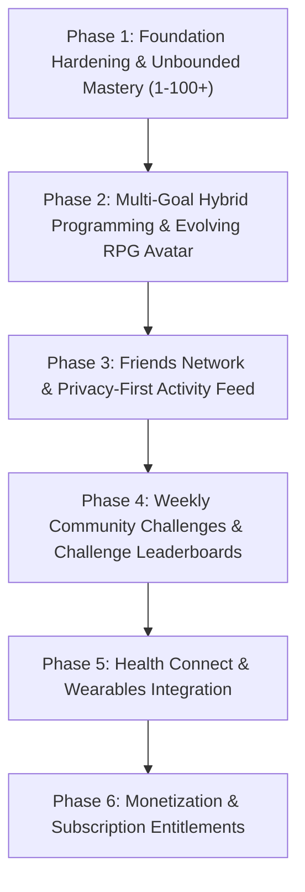

# ASCEND PRODUCT EXPANSION PLAN & ROADMAP

**Document Version:** 1.0.0  
**Planning Date:** September 2026  
**Status:** Architecture Blueprint & Implementation Roadmap  
**Target Milestone:** Fitness + RPG + Social Progression Evolution  
**Baseline Compatibility:** Zero Data Loss Guarantee | 100% Backward Compatible

---

## 1. Executive Roadmap Overview

This roadmap defines the precise, phased implementation strategy to expand the ASCEND fitness RPG application from its current solid baseline into a complete social, athletic, and evolving RPG ecosystem.

### Guiding Engineering Principles:
1. **Zero Data Loss Guarantee**: Local SQLite databases on existing user devices must never be dropped, wiped, or corrupted during schema updates.
2. **Offline-First Non-Negotiable**: Every single feature—including challenges, friends feed caching, and hybrid workouts—must be operable offline and synchronize seamlessly when reconnected.
3. **Decoupled Progression & Anti-Exploit**: Exercise Mastery XP (1–100+) and Player Character XP remain strictly decoupled in independent ledgers protected by idempotency keys.
4. **Privacy-by-Default**: Workouts and telemetry are strictly private by default. Zero health data, bodyweight logs, or personal notes are ever exposed to the public or friends.

---

## 2. Recommended Phased Implementation Order

### Dependency Rationale:
- **Phase 1 before Phase 2**: The database sync gap on nutrition logs must be resolved and the mastery level curve extended to 100+ before adding new hybrid attributes and character avatar stages.
- **Phase 2 before Phase 3**: The user's evolving character and hybrid identity (e.g. Titan, Vanguard, Berserker) must be established before sharing workouts and displaying profiles to friends.
- **Phase 3 before Phase 4**: Friends system and user connection mechanics provide the foundation for friend-filtered challenge leaderboards.
- **Phase 4 before Phase 5**: Game progression and challenge reward systems must be locked before integrating wearable data that feeds into those metrics.
- **Phase 5 before Phase 6**: All high-value premium features (wearables, advanced analytics, AI generation) must exist before gating them behind ASCEND PRO subscriptions.

---

## 3. Detailed Phase Breakdown & Acceptance Criteria

### Phase 1: Foundation Hardening, Nutrition Sync & Unbounded Mastery (1 → 100+)
**Objective:** Resolve existing technical debt, close the remote sync gap for nutrition, extend mastery levels beyond 100 with prestige scaling, and make the rest timer background-resilient.

#### Planned Changes:
1. **Nutrition Outbox Enqueue**:
   - Update `NutritionRepository.logDailyNutrition` to enqueue a `'nutrition_log'` record into `local_sync_queue` with idempotency key `nutr:${userId}:${date}`.
2. **Unbounded Exercise Mastery (1 → 100+)**:
   - Update `src/config/progression.config.ts`: Change `maxLevel` from hardcoded 100 to dynamic scaling (base levels 1–100 + prestige ranks Grandmaster I–X for 101–150+).
   - Update `MasteryEngine.getExerciseLevelFromXP`: Remove hard level clamp; calculate monotonic levels beyond 100 using formula `XP(L) = round(100 * L^1.25)`.
   - Update `src/constants/ranks.ts`: Add `SSS+` and Prestige tiers for levels > 100.
3. **Rest Timer Wall-Clock Synchronization**:
   - In `useWorkoutStore.ts`, store `restTimerTargetTimestamp: number | null`.
   - On every tick and app resume, calculate `remaining = Math.max(0, Math.ceil((targetTimestamp - Date.now()) / 1000))` to prevent timer stalls when the app is backgrounded.

#### Acceptance Criteria:
- [ ] Logging nutrition enqueues an item in `local_sync_queue` and verifies remote sync via `SyncEngine.test.ts`.
- [ ] Accumulating XP past Level 100 advances the exercise level to 101+ with correct Prestige badge rendering.
- [ ] Minimizing and reopening active workout during a rest timer maintains accurate remaining time.
- [ ] All 163 existing tests continue to pass with 0 regressions.

---

### Phase 2: Dual Goals, Hybrid Programming & Evolving RPG Avatar
**Objective:** Allow users to pick primary and secondary athletic goals, generate periodized hybrid programs (e.g. Powerbuilding, Athletic Strength), and visually evolve their RPG character avatar.

#### Planned Changes:
1. **Schema Migration**:
   - SQLite + Supabase migration: Add `secondary_goal TEXT`, `hybrid_style TEXT`, `avatar_stage INTEGER DEFAULT 1`, `character_archetype TEXT DEFAULT 'VANGUARD'` to `profiles`.
2. **Onboarding & Goal Selection UI**:
   - Update `StepGoal.tsx` to allow selecting:
     - **Primary Goal**: Absolute Strength, Hypertrophy, Athleticism, Conditioning, Endurance.
     - **Secondary Goal**: Complementary athletic objective (e.g. Strength + Hypertrophy = Powerbuilding).
   - Add hybrid split options (e.g. Upper/Lower + Conditioning, Push/Pull/Legs + Speed).
3. **AI & Deterministic Generator Expansion**:
   - Update `AIPlanResponseSchema`, `RequestSchema`, and `DeterministicWorkoutGenerator` to accept `primary_goal` and `secondary_goal`.
   - Generate balanced hybrid splits combining heavy compound strength (sets of 3–5) with high-density hypertrophy/hyper-conditioning (sets of 8–15).
4. **Evolving Character Avatar System**:
   - Implement `src/components/character/EvolvingAvatar.tsx`: Modular visual character displaying evolution stages (Stage 1: Initiate, Stage 2: Operative, Stage 3: Vanguard, Stage 4: Warlord, Stage 5: Ascended Titan) based on `global_level` and dominant attributes.

#### Acceptance Criteria:
- [ ] Onboarding allows selecting both primary and secondary goals.
- [ ] Profile displays character archetype and dynamic evolving avatar.
- [ ] AI plan generator and offline deterministic fallback generate valid hybrid workout schedules.
- [ ] Unit tests verify multi-goal validation and character stage calculations.

---

### Phase 3: Friends Network & Privacy-First Activity Feed
**Objective:** Build a robust social layer allowing operatives to follow friends, view shared workouts, and celebrate PRs with zero health data leakage.

#### Planned Changes:
1. **Database Schema (SQLite & Supabase)**:
   - Create `friendships` table: `(id, user_id, friend_id, status: PENDING | ACCEPTED | BLOCKED, created_at, updated_at)`.
   - Create `social_feed_posts` table: `(id, user_id, workout_id, caption, visibility: PRIVATE | FRIENDS | PUBLIC, likes_count, created_at)`.
   - Add `is_shared INTEGER DEFAULT 0` and `share_visibility TEXT DEFAULT 'PRIVATE'` to `workouts`.
2. **Strict RLS & Privacy Policies**:
   - Feed query strictly returns ONLY workouts where `is_shared = 1` AND friendship is `ACCEPTED`.
   - Set logs, heart rate, personal notes, and bodyweight are NEVER joined or returned in social feed endpoints.
3. **UI Components & Screens**:
   - `src/app/(tabs)/social/index.tsx`: Tactical activity feed showing friends' completed workouts, PR cards, and kudos.
   - Friend management modal: Search by operative handle, send request, accept/reject, block.
   - Post-workout sharing prompt: Explicit opt-in toggle asking "Share this session with friends?" (default unchecked).

#### Acceptance Criteria:
- [ ] User can search, request, and accept friends.
- [ ] Workouts are completely hidden from friends unless explicitly shared.
- [ ] Biometric data, nutrition, and private notes never leak into social payload.
- [ ] Offline caching allows reading previously loaded feed posts without internet connection.

---

### Phase 4: Weekly Community Challenges & Challenge Leaderboards
**Objective:** Introduce weekly competitive challenges (e.g. "Iron Crucible: 25,000kg Squat Volume", "Century Rep Club") with live leaderboards and exclusive bounty XP.

#### Planned Changes:
1. **Database Schema**:
   - Create `weekly_challenges` table: `(id, title, description, category, metric, target_value, start_date, end_date, reward_xp, badge_asset)`.
   - Create `user_challenges` table: `(id, user_id, challenge_id, current_progress, completed, completed_at, rank_position)`.
2. **Challenge Evaluation Engine**:
   - Implement `src/services/progression/ChallengeEngine.ts`: Evaluates completed workout volume, reps, and exercise criteria against active challenges.
   - Automatic progress increments with idempotent ledger rewards upon completion.
3. **Challenge UI & Leaderboards**:
   - Challenge card on Home dashboard and Quests tab with live progress bar and countdown timer.
   - Dedicated Challenge Leaderboard modal showing operative rankings for that specific challenge.

#### Acceptance Criteria:
- [ ] Workouts matching challenge criteria advance challenge progress automatically.
- [ ] Challenge completion awards XP once and only once via idempotent ledger.
- [ ] Expired challenges roll over deterministically each Monday at 00:00 UTC.

---

### Phase 5: Health Connect & Wearable Integration Layer
**Objective:** Connect Google Health Connect on Android and Apple HealthKit on iOS to ingest heart rate, active calories, and steps into workout dossiers.

#### Planned Changes:
1. **Module Integration & Permissions**:
   - Install `react-native-health-connect` with Expo Config Plugin.
   - Configure `app.json` with required Health Connect Android 14+ permissions (`android.permission.health.READ_HEART_RATE`, `READ_STEPS`, `READ_ACTIVE_CALORIES_BURNED`).
2. **Health Data Adapter**:
   - Implement `src/services/health/HealthConnectService.ts`: Check availability, request runtime permissions with clear privacy rationale, query session metrics.
   - Normalize wearable data into `heart_rate_avg`, `heart_rate_max`, and `calories_burned` mapped to workout session timestamps.
3. **In-Workout HUD & Dossier Integration**:
   - Show live/synced heart rate badge on `active-workout.tsx` when wearable is paired.
   - Display heart rate intensity zones in completed workout summary.

#### Acceptance Criteria:
- [ ] App prompts for Health Connect permissions only after user taps "Connect Wearable".
- [ ] Denied permissions fail gracefully without crashing or disabling manual logging.
- [ ] Heart rate data enriches workout telemetry when authorized.

---

### Phase 6: Monetization Foundations & Subscriptions (ASCEND PRO)
**Objective:** Establish sustainable monetization foundations with feature tiers, entitlement checks, and frictionless paywall gates.

#### Planned Changes:
1. **Subscription Store & Service**:
   - Implement `src/store/useSubscriptionStore.ts` with tier state (`FREE` | `PRO_MONTHLY` | `PRO_ANNUAL` | `LIFETIME`).
   - Mock entitlement adapter for staging and clean interface for RevenueCat / StoreKit / Google Play Billing.
2. **Feature Gating System**:
   - Create `useSubscriptionGate(featureKey)` hook.
   - **FREE Tier**: Unlimited standard logging, 1 active workout plan, standard exercise mastery, basic stats.
   - **PRO Tier**: Unlimited AI plan generations, advanced 1RM forecasting sparklines, wearable sync, custom routine folders, exclusive RPG character armor cosmetics.
3. **Paywall UI**:
   - `src/components/monetization/PaywallModal.tsx`: High-conversion tactical UI showcasing Pro benefits, annual discount toggle, and restore purchases button.

#### Acceptance Criteria:
- [ ] Free users can complete workouts and progress indefinitely without forced paywalls.
- [ ] Accessing Pro features triggers the Paywall modal cleanly.
- [ ] Active subscription grants instantaneous access across all gated components.

---

## 4. Zero-Loss Database Migration Strategy

All SQLite schema modifications must follow this zero-loss protocol:

1. **Additive-Only Migrations**:
   - Columns are added via `ALTER TABLE ... ADD COLUMN ...` with conservative default values.
   - Never drop tables or modify existing column types in production databases.
2. **Safe Migration Runner**:
   - All migrations registered in `src/database/migrations/init.ts` within the `columnsToAdd` list or dedicated versioned migration steps.
   - Every DDL operation wrapped in `try/catch` to guarantee idempotency on existing installs.
3. **Supabase Migration Parity**:
   - Companion PostgreSQL migrations stored in `supabase/migrations/` with identical table names, column names, and RLS policies.

---

## 5. Risk Mitigation Matrix

| Potential Risk | Severity | Mitigation Strategy |
|---|:---:|---|
| **Health Connect Native Build Failure** | High | Abstract Health Connect behind an interface; mock fallback for Expo Go and unlinked builds. |
| **Social Feed Spam or Toxic Content** | Medium | Workouts are structured logs (no open markdown text comments without moderation); blocking and reporting built-in. |
| **Duplicate Challenge XP Exploits** | High | Enforce UNIQUE constraint on `xp_transactions (user_id, source_type, source_id)` where `source_id = challenge_id`. |
| **App Store Review Rejection for Wearables** | Medium | Provide clear permission justification strings in `app.json` explaining why heart rate data enhances workout analysis. |

---

## 6. What Must NOT Be Touched or Rewritten

The following established systems are working correctly, thoroughly tested, and **MUST NOT** be refactored, replaced, or redesigned:

1. **`MasteryRepository` & `MasteryEngine` Core Calculations**: The canonical Epley 1RM equation (`weight * (1 + reps / 30)`), relative strength logic, and decoupled exercise XP mathematics.
2. **`XpRepository` & Idempotency Engine**: The unique ledger indexing preventing duplicate rewards.
3. **`SyncQueueRepository` & `SyncEngine` Exponential Backoff**: The offline-first queuing, status transitions, and NetInfo reconnection listeners.
4. **`SupersetEngine` & Interleaving Logic**: The A1/A2 linking, auto-advancing target set, and order indexing.
5. **AI Zero-Trust Architecture**: The server-side Gemini invocation via Supabase Edge Function with client-side Zod and deterministic offline fallbacks.
